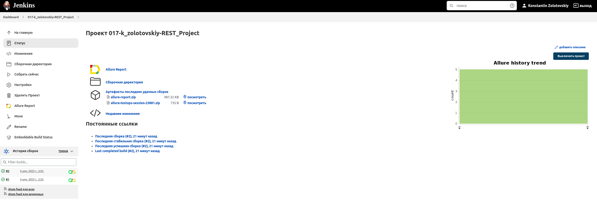
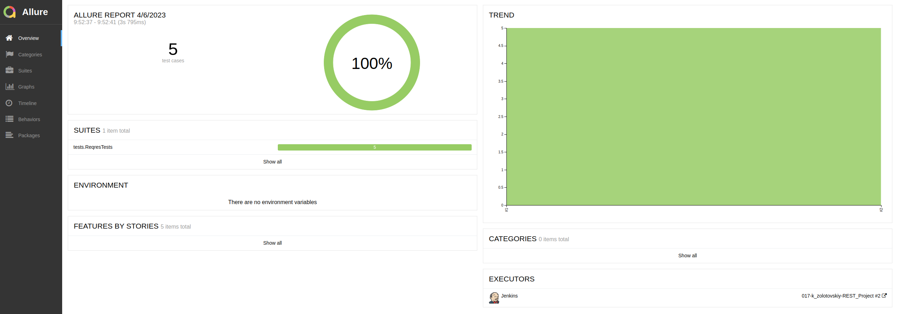
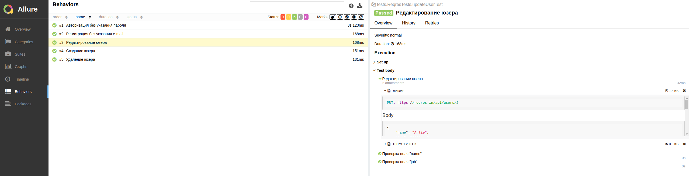
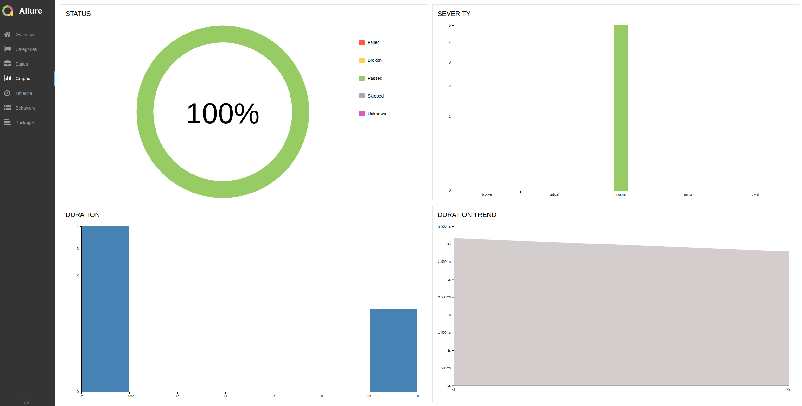
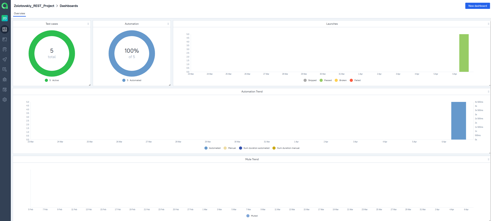
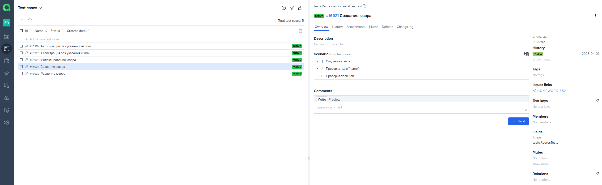
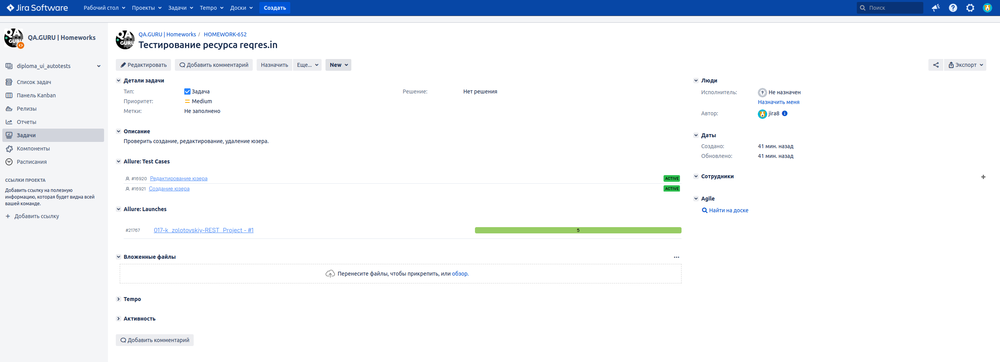
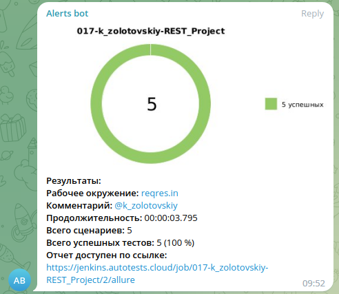

<h1 >Проект по автоматизации тестирования сайта <a href="https://reqres.in">REQRES.IN</a></h1>

## Содержание

* <a href="#tools">Технологии и инструменты</a>
* <a href="#cases">Реализованные проверки</a>
* <a href="#console">Запуск тестов из терминала</a>
* <a href="#jenkins">Запуск тестов в Jenkins</a>
* <a href="#allure">Отчеты в Allure</a>
* <a href="#testops">Интеграция с Allure TestOps</a>
* <a href="#testops">Интеграция с Jira</a>
* <a href="#telegram">Уведомления в Telegram с использованием бота</a>

<a id="tools"></a>

## Технологии и инструменты

<div align="center">
<a href="https://www.jetbrains.com/idea/"></a>
<a href="https://github.com/"></a>  
<a href="https://www.java.com/"></a>
<a href="https://gradle.org/"></a>  
<a href="https://junit.org/junit5/"></a>
<a href="https://www.jenkins.io/"></a>
<a href="https://github.com/allure-framework/"></a>
<a href="https://qameta.io/"></a>
<a href="https://www.atlassian.com/software/jira"></a>  
<a href="https://telegram.org/"></a>
</div>

Автотесты написаны на <code>Java</code> с использованием <code>JUnit 5</code> и <code>Gradle</code>.
Для UI-тестов использована библиотека [REST Assured](https://rest-assured.io/).
Запуск тестов можно осуществлять локально или с помощью с помощью Jenkins/Allure TestOps.
Также реализована сборка в <code>Jenkins</code> с формированием Allure-отчета и отправкой уведомления с результатами
в <code>Telegram</code> после завершения прогона.

<a id="cases"></a>

## Реализованные проверки

### Автоматизированные проверки

- ✓ Создание юзера
- ✓ Редактирование юзера
- ✓ Удаление юзера
- ✓ Проерка текста сообщения о ошибке, при авторизации без указания пароля
- ✓ Проерка текста сообщения о ошибке, при регистрации без указания e-mail

<a id="console"></a>

## Запуск тестов из терминала

```
gradle clean test
```

<a id="jenkins"></a>

## Запуск тестов в <a target="_blank" href="https://jenkins.autotests.cloud/job/017-k_zolotovskiy-REST_Project/"> Jenkins </a>

<p align="center">

</p>

<a id="allure"></a>

## Отчеты в <a target="_blank" href="https://jenkins.autotests.cloud/job/017-k_zolotovskiy-REST_Project/2/allure/"> Allure report </a>

### Основное окно

<p align="center">

</p>

### Тесты

<p align="center">

</p>

### Графики

<p align="center">

</p>

<a id="testops"></a>

## Интеграция с <a target="_blank" href="https://allure.autotests.cloud/project/2131/test-cases?treeId=0"> Allure TestOps </a>

### Доска

<p align="center">

</p>

### Тест-кейсы

<p align="center">

</p>

<a id="jira"></a>

## Интеграция с <a target="_blank" href="https://jira.autotests.cloud/browse/HOMEWORK-645"> Jira </a>

<p align="center">

</p>

<a id="telegram"></a>

## Уведомления в Telegram с использованием бота

<p>

</p>
